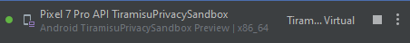

# EnergySaver - Sistema de Gerenciamento de Energia
Código escrito usando React Native @0.72.6. 

## Pré-requisitos

Antes de executar o código, certifique-se de ter todas as dependências instaladas.

```bash
npm install
```

Para rodar o codigo, execute o comando dentro da folder ./src
```bash
npx expo start
```
## Recomendações

Utilizar o [Android Studio](https://developer.android.com/studio?gclid=CjwKCAiAkp6tBhB5EiwANTCx1KH2_cH8uIdQOgJ2wlCAV80bdDuEokHjvCSn0bpNIwvjKG1qQUOAwhoCuNUQAvD_BwE&gclsrc=aw.ds&hl=pt-br) para desenvolver e visualizar o aplicativo.

A versão do android utilizada para desenvolver foi:




